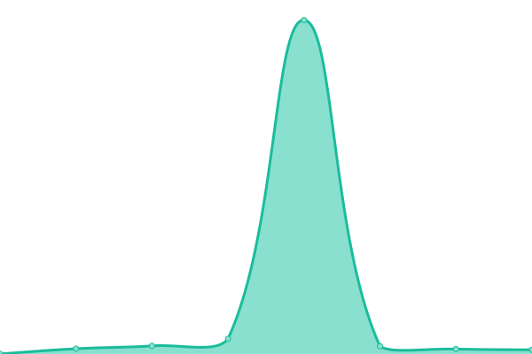

# [📈 Live Status](https://status.shovon.me): <!--live status--> **🟧 Partial outage**

This repository contains the open-source uptime monitor and status page for [shovon](shovon.me), powered by [Upptime](https://github.com/upptime/upptime).

With [Upptime](https://upptime.js.org), you can get your own unlimited and free uptime monitor and status page, powered entirely by a GitHub repository. We use [Issues](https://github.com/ajshovon/status.shovon.me/issues) as incident reports, [Actions](https://github.com/ajshovon/status.shovon.me/actions) as uptime monitors, and [Pages](https://status.shovon.me) for the status page.

<!--start: status pages-->
<!-- This summary is generated by Upptime (https://github.com/upptime/upptime) -->
<!-- Do not edit this manually, your changes will be overwritten -->
<!-- prettier-ignore -->
| URL | Status | History | Response Time | Uptime |
| --- | ------ | ------- | ------------- | ------ |
|  [shovon.me](https://shovon.me) | 🟩 Up | [shovon-me.yml](https://github.com/ajshovon/status.shovon.me/commits/HEAD/history/shovon-me.yml) | 

 1432ms
     
 | 

<a href="https://status.shovon.me/history/shovon-me">94.82%</a>
    

|  [shovon.xyz](https://shovon.xyz) | 🟥 Down | [shovon-xyz.yml](https://github.com/ajshovon/status.shovon.me/commits/HEAD/history/shovon-xyz.yml) | 

 1746ms
     
 | 

<a href="https://status.shovon.me/history/shovon-xyz">87.50%</a>
    

|  KVM SG | 🟥 Down | [kvm-sg.yml](https://github.com/ajshovon/status.shovon.me/commits/HEAD/history/kvm-sg.yml) | 

 212ms
     
 | 

<a href="https://status.shovon.me/history/kvm-sg">87.51%</a>
    

<!--end: status pages-->

[**Visit our status website →**](https://status.shovon.me)

## 📄 License

- Powered by: [Upptime](https://github.com/upptime/upptime)
- Code: [MIT](./LICENSE) © [Anand Chowdhary](https://anandchowdhary.com), supported by [Pabio](https://pabio.com)
- Data in the `./history` directory: [Open Database License](https://opendatacommons.org/licenses/odbl/1-0/)
